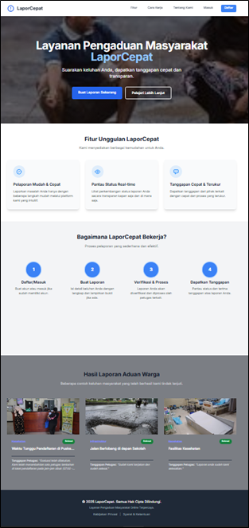
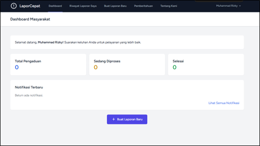
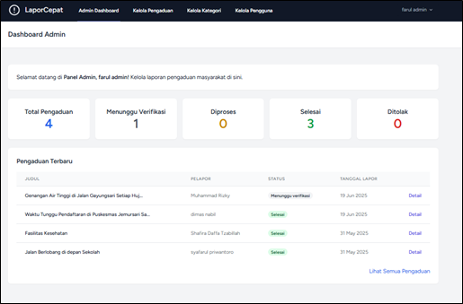
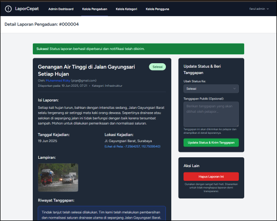

# 🗣️ LaporCepat - Layanan Pengaduan Masyarakat Online

**Suarakan keluhan Anda, dapatkan tanggapan cepat dan transparan.**

LaporCepat adalah aplikasi web modern yang menjembatani komunikasi antara masyarakat dan instansi pemerintah. Aplikasi ini memungkinkan masyarakat melaporkan masalah publik seperti jalan rusak, tumpukan sampah, atau gangguan layanan lainnya secara **mudah**, **cepat**, dan **transparan**.

---

## 🚀 Fitur Utama

### 🔹 Untuk Masyarakat
- **Registrasi & Login** – Sistem autentikasi pengguna yang aman.
- **Buat Laporan** – Formulir untuk memasukkan keluhan lengkap dengan judul, deskripsi, kategori, dan tanggal kejadian.
- **Unggah Lampiran** – Bisa melampirkan foto atau video bukti.
- **Lokasi GPS** – Fitur "Gunakan Lokasi Saya Saat Ini".
- **Pantau Status** – Melihat riwayat laporan dan statusnya (Menunggu Verifikasi, Diproses, Selesai, Ditolak).
- **Notifikasi Real-time** – Lewat aplikasi dan email.
- **Halaman Profil** – Mengelola informasi akun pengguna.

### 🔸 Untuk Admin
- **Dashboard Admin** – Menampilkan statistik laporan.
- **Kelola Pengaduan** – Menyaring dan memproses laporan masuk.
- **Update Status & Tanggapan** – Memberi status terbaru dan tanggapan publik.
- **Kelola Pengguna** – Mengelola data pengguna & peran.
- **Kelola Kategori** – Menambah, mengedit, dan menghapus kategori laporan.

---

## 🖼️ Tampilan Aplikasi

### 🏠 Halaman Utama


### 👤 Dashboard Masyarakat


### 🛠️ Dashboard Admin


### 📄 Detail Laporan


---

## 🛠️ Teknologi yang Digunakan

| Komponen  | Teknologi |
|-----------|-----------|
| Backend   | Laravel 10, PHP 8.2 |
| Frontend  | Blade, Tailwind CSS, Vite |
| Database  | MySQL |
| Email     | Mailtrap |

---

## ⚙️ Instalasi & Konfigurasi

### 1. Clone Repository
```bash
git clone https://github.com/username/lapor-cepat.git
cd lapor-cepat
````

### 2. Instalasi Dependensi

```bash
composer install
npm install
```

### 3. Konfigurasi Environment

```bash
cp .env.example .env
php artisan key:generate
```

### 4. Atur Database di `.env`

```env
DB_CONNECTION=mysql
DB_HOST=127.0.0.1
DB_PORT=3306
DB_DATABASE=lapor_cepat_db
DB_USERNAME=root
DB_PASSWORD=
```

### 5. Migrasi & Seeding Database

```bash
php artisan migrate:fresh --seed
```

### 6. Link Storage

```bash
php artisan storage:link
```

### 7. Jalankan Server

**Terminal 1 (Backend):**

```bash
php artisan serve
```

**Terminal 2 (Frontend):**

```bash
npm run dev
```

Buka browser dan akses aplikasi di [http://127.0.0.1:8000](http://127.0.0.1:8000)

---

## 🔑 Akun Default (Setelah Seeder)

* **Email**: [admin@admin.com](mailto:admin@admin.com)
* **Password**: password

---

